# Git And SSH

## How to Set Up your SSH key for GitHub on Windows 10

-- One of the most common issues while getting started with Git and GitHub is setting up the SSH private and public keys. On top of this, Git password authentication is no longer available on GitHub.

_Last updated: January 2022_

# Background

As of August 13, 2021, GitHub is no longer allowing you to use your Github account password to work with Git. One easy and much more secure way of interacting with your GitHub repositories is to generate an SSH key and to close your Git repositories with SSH.

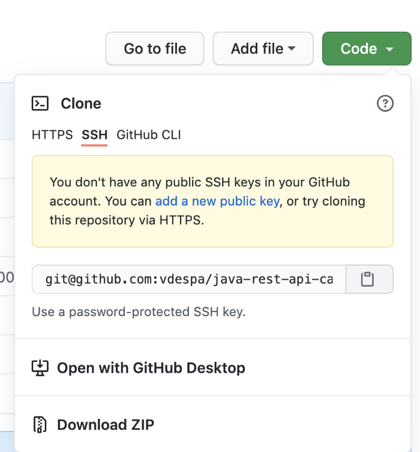

The most common error you may get when trying to close a Git repository over SSH is this one:

> git@github.com: Permission denied (publickey,keyboard-interactive). fatal: Could not read from remote repository.

# What is SSH?

SSH is a way to authenticate with a server like GitHub, without exposing your username and password.

SSH stands for Secure Shell and is a cryptographic protocol based on the concept of public-private keys.

We are using SSH with Git because it is much easier than typing your username and password all the time, and it is also more secure.

You have probably noticed that GitHub is complaining that you don’t have an SSH key.

> You don’t have any public SSH keys in your GitHub account.

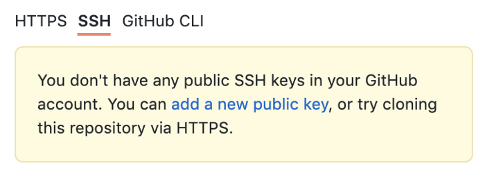

Let’s fix that.

# Step 1 — Installing Git

Open any terminal and check if you already have Git installed by typing:

`git --version`

If you are getting back an error message, you need to install Git. I would anyway recommend installing/updating Git anyway.

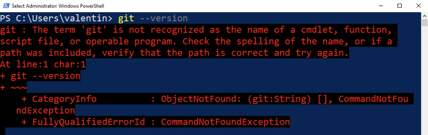

Git is not present on the system yet.

Go ahead and open [https://git-scm.com/](https://git-scm.com/). The latest version I see is 2.30.0.

Now open the installer you have downloaded and go through the installation process. Unless you know what you are doing, **leave all settings to their defaults**.

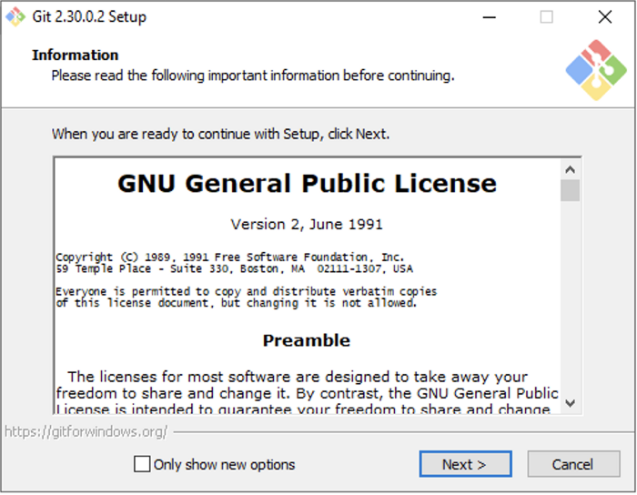

Accept the license.

> Please let me know if any of the setup process has changed. Thanks! _🤗_

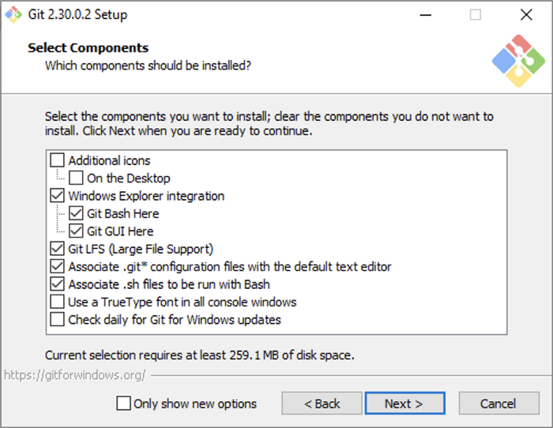

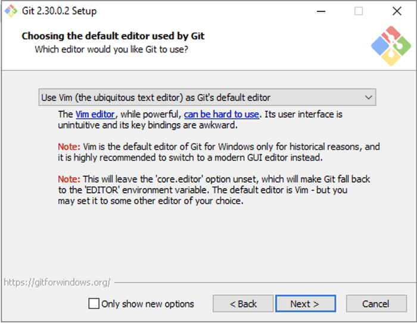

If you already have Notepad++ or a better text editor installed, you may select something else.

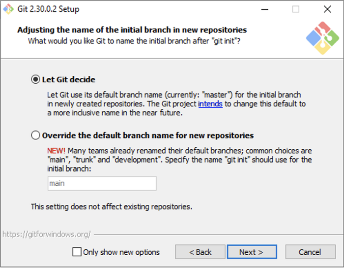

This is Git trying to be more inclusive. Most Git repositories still use master as their primary branch. There is a movement to replace master with main.

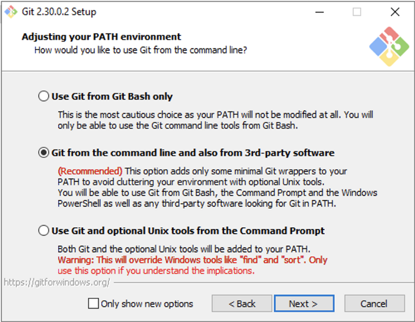

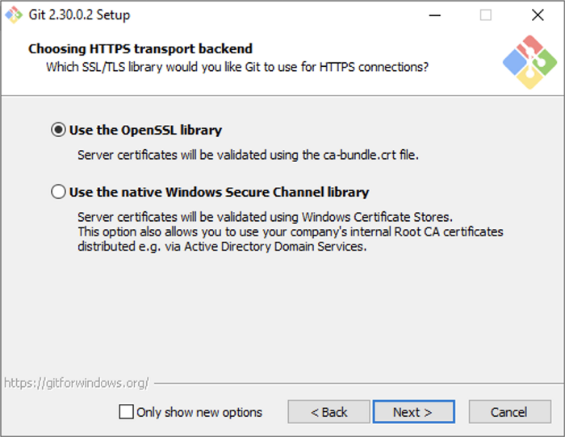

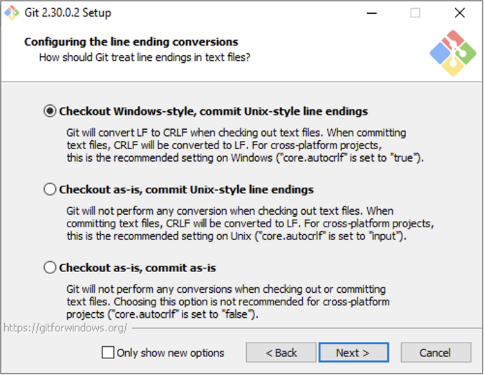

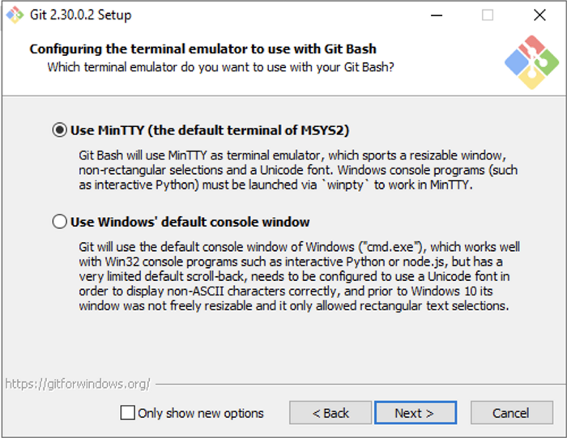


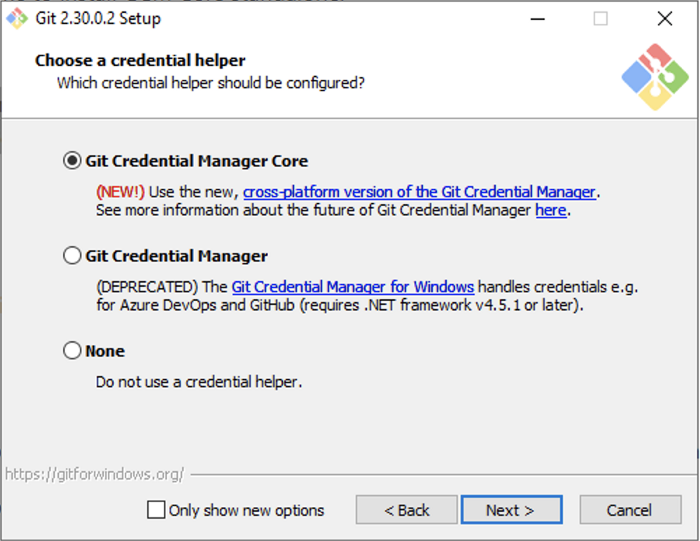

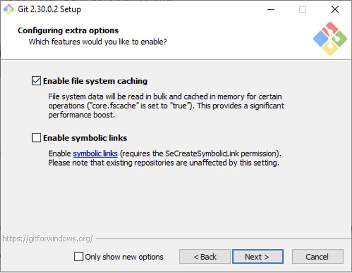

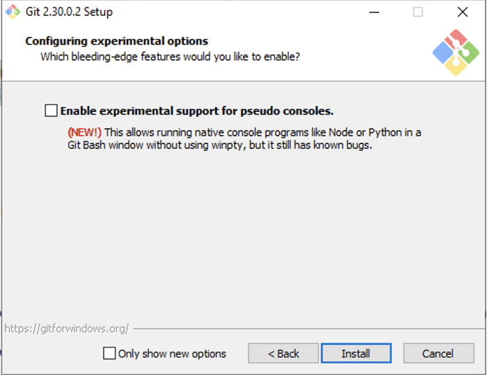

Finally the Install button.

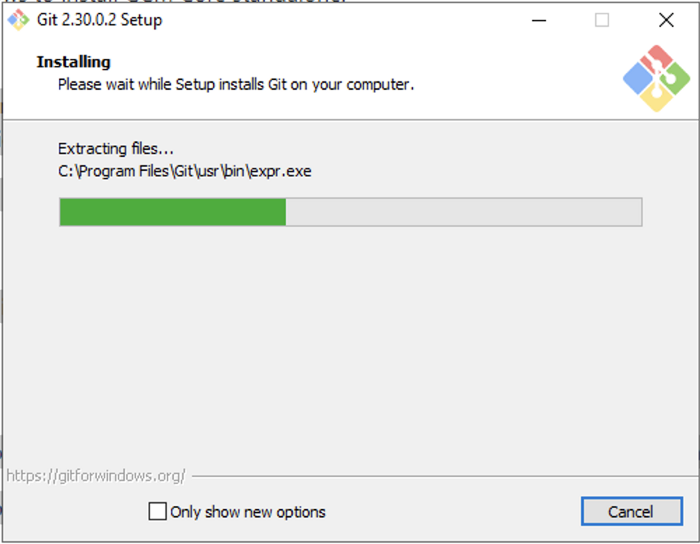

Give it a few seconds to complete.

This wizard has also installed a new tool called **Git Bash**, a terminal alternative for Cmd or Powershell. I will use it to demonstrate the upcoming steps.


Click on the checkbox to launch Git Bash and click on Finish.

From Git Bash or your terminal of choice, run the following command.

```
git --version
```

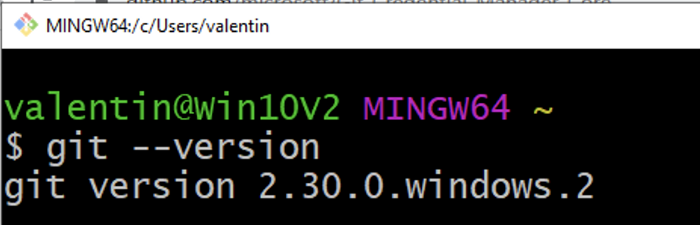

The current Git version should be displayed

> If you enjoy content like this and it helped you solve a problem, help me create more. **Please leave a comment, share, and press that 👏 a few times (up to 50 times).**

# Step 2 — Configuring Git

Before we move forward, adapt the following commands with your name and email. They will be part of any changes you make to any Git repository. Do it now, otherwise, your work colleagues will give you a minus point.

```
git config --global user.name "Your Name"git config --global user.email “you@example.com”
```

# Step 3 — Cloning a GitHub repository

Log in to your GitHab account and go to the repository you want to clone. I am assuming you are cloning your own repositories (public or private) with the intend of making changes.

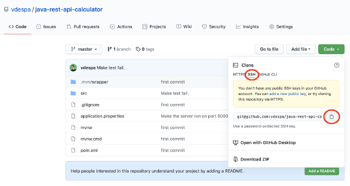

Click on the green _Code_ button, select SSH if not already selected, and copy the address displayed there.

Run the command

```
git clone (PASTE HERE YOUR ADDRESS)
```

Getting a warning with: _“The authenticity of host ‘github.com’ can’t be established.”_ should not worry you. If this is the first time you connect to this server, you will get this warning. Select “yes” and it won’t bother you again.

> git@github.com: Permission denied (publickey,keyboard-interactive). fatal: Could not read from remote repository.

Getting this error is normal. We will fix it in a moment.

# Step 4 — Generating an SSH key

We will be using a tool called **ssh-keygen**. So open a terminal and run this command:

```
ssh-keygen
```

First, you will be asked about the location where the keys should be stored. By default, your user folder will contain a folder called `.ssh`. Leave it as it is and hit the _Enter_ key.


Next, you will be asked to set a password to protect your private key. Without a password, anyone obtaining your private key can impersonate you.

While it is a good practice to set a password, it is very hard in Windows to store that password in a way that you don’t have to type it every time you run a command in Git. For that reason, leave it empty for now and simply hit _Enter_ two times.

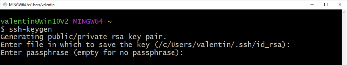

Your public/private key pair has been generated.

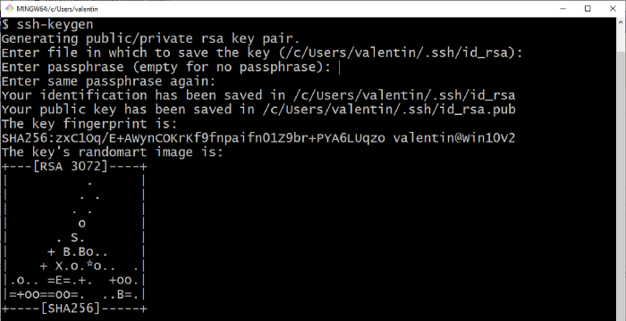

Let’s recap what you now have:

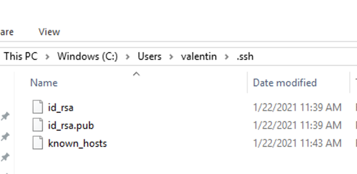

The contents of the .ssh folder.

-   **id\_rsa** — this is your **PRIVATE** key. Don’t share this with anyone else. This is your secret.
-   **id\_rsa.pub** — this is your **PUBLIC** key. This contains no secrets. You can share it with others.

# Step 5 — Adding your SSH key to GitHub

With your favorite text editor, open your public key. I will use the terminal and the `cat` command to view the contents of the file.

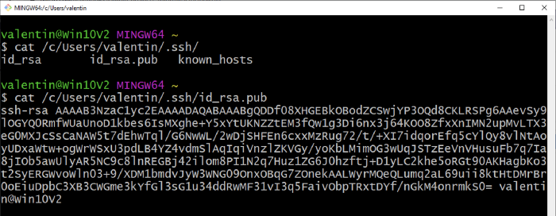

Copy the entire contents of the file.

In GitHub, go to your profile settings and locate _SSH and GPG keys_ or simply [follow this link to add a new SSH key.](https://github.com/settings/ssh/new)

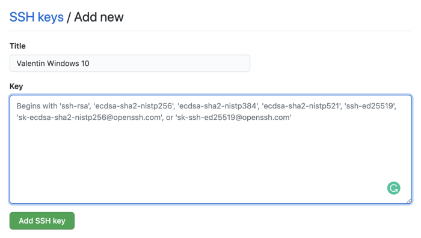

Paste your **public key** in the big text box you see on the screen and finally click _Add SSH key_. I highly recommend you give your key a name so that you can easily identify it later.

# Step 6 — Cloning a GitHub repository (again)

Now it is time to run the clone command again and it should work.

Now Git is integrated with any tools or code editors that you may be using. You can push and pull changes from GitHub without issues.

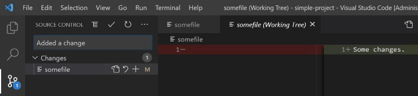

Git commit from Visual Studio Code.

# Conclusion

I hope this tutorial helped you get started with configuring your Git installation in Windows 10 to work with GitHub. Leave a comment in the section below if you have any questions. I would love to hear from you!